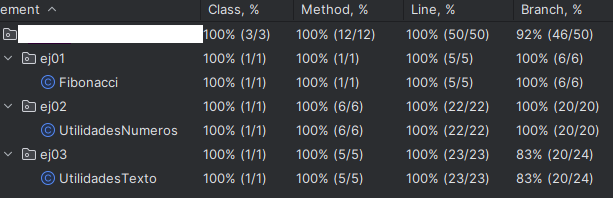

# Tarea evaluable 4.5. Covertura de pruebas con JUnit 5

En esta tarea evaluable se van a realizar una serie de ejercicios para practicar el uso de JUnit 5. Para su realización se recomienda seguir los siguientes pasos:

- Todos los ejercicios se entregan dentro de un proyecto de IntelliJ.
- El proyecto debe ser gestionado por Maven.
- Copiar este fichero `readme.md` en la raiz del proyecto.
- Nombre del proyecto: `AprendiendoJUnit`.
- Paquete raiz del proyecto: `com.{apellido1.nombre}.AprendiendoJUnit`.

### Entrega

- El proyecto debe crearse dentro de la ruta `UT4/TE4.4/` de vuestro repositorio.
- Copiar el enlace a la carpeta `UT4/TE4.4/` y pegar en el formulario de entrega de la tarea evaluable.

### Recursos

- [JUnit 5 User Guide](https://junit.org/junit5/docs/current/user-guide/)
- [Curso de JUnit 5](https://www.youtube.com/playlist?list=PLTd5ehIj0goPcVH3xhSudzyazW8CtMvsq)
- [Maven in 5 Minutes](https://maven.apache.org/guides/getting-started/maven-in-five-minutes.html)

### Enuncionado

Copia el proyecto `TE4.3\AprendiendoJUnit` a la carpeta `UT4\TE4.4\` y ejecuta los test con covertura de pruebas. Para ello, sigue los siguientes pasos:

1. Abre el proyecto `TE4.4\AprendiendoJUnit` en IntelliJ.
2. Y desde la carpeta `src/test/java/...` botón derecho y selecciona `More Run/Degug > Run 'All Tests' with Coverage`.
3. Ejecuta los test, y en la parte derecha de la pantalla, aparecerá un gráfico de la cobertura de pruebas.

En esta imagen, se puede puede apreciar que existen los siguientes tipos de cobertura:

- **Line coverage**: Porcentaje de líneas de código ejecutadas por los test.
- **Branch coverage**: Porcentaje de ramas ejecutadas por los test.
- **Method coverage**: Porcentaje de métodos ejecutados por los test.
- **Class coverage**: Porcentaje de clases ejecutadas por los test.

Como se puede observar, la clase `UtilidadesTexto` tiene una cobertura del 100% en todo, excepto para la cobertua de "Branch coverage".

**Corrige los test, agregnando nuevos, para conseguir una cobertura del 100% en todos los tipos de cobertura.**

> 🧲 Adjunta una imagen donde se visualize la cobertura de los test.

> 🧲  Adjuntar un GIF donde se visualize que el resultado de pasar los test y se muestre la cobertura de código resultante.

